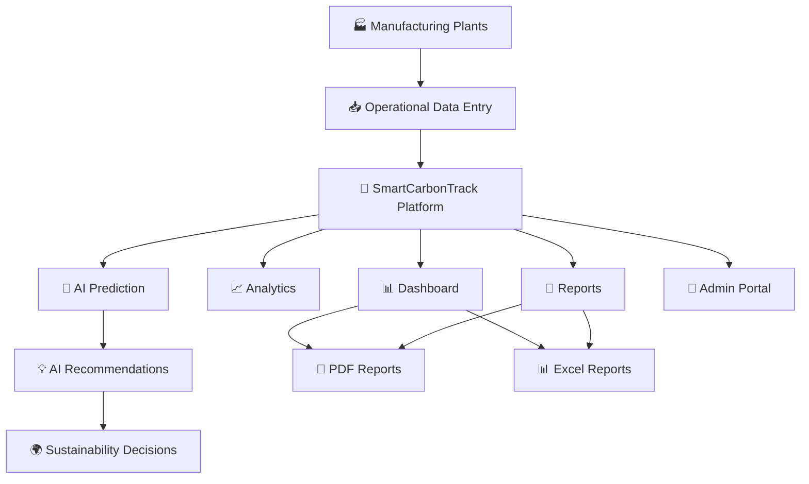

# 🌱 SmartCarbonTrack

### AI-Powered Carbon Intelligence & Sustainability Management Platform

> **"Measure Today. Predict Tomorrow. Build a Greener Future."**


## 🏆 Hackathon Project

- 🌍 **Domain:** Green Technology | ESG | Sustainability
- 🤖 **Innovation:** AI-Driven Carbon Intelligence Platform
- 🏭 **Industry Focus:** Manufacturing Industries
- 🎯 **Target Users:** Plant Managers, ESG Teams, Sustainability Officers & Administrators


## 🚀 Problem Statement

Industries often struggle with fragmented carbon monitoring, manual ESG reporting, and the lack of predictive insights for future sustainability planning.

**SmartCarbonTrack** provides a centralized platform that enables industries to **monitor emissions, analyze performance, generate compliance reports, and forecast future carbon reduction strategies** through an intuitive and intelligent dashboard.


# ✨ Key Features

- 📊 Real-Time Carbon Monitoring Dashboard
- 🏭 Multi-Plant Management
- 📥 Manual Operational Data Entry
- 📈 Advanced Analytics & KPI Tracking
- 🤖 AI Prediction & Carbon Forecasting
- 🌍 Scenario-Based Future Simulation (3, 5 & 10 Years)
- 📑 Professional PDF & Excel Report Generation
- 👥 Role-Based Access (Admin & Plant Manager)
- 📍 Plant-wise Performance Monitoring
- 💡 AI Sustainability Recommendations
- 🌱 Carbon Reduction & ESG Compliance Tracking


# 📥 Getting Started

### Step 1 — Login
## 👨‍💼 Admin

| Username | Password |
|----------|----------|
| admin    | password123 |

---

## 🏭 Plant Manager

| Username | Password |
|----------|----------|
| Delhi    | password123 |

Use the credentials below to access the platform.

### Step 2 — Enter Operational Data

Before analytics and forecasting can be generated, users must manually enter operational data through the **Data Entry** module or select previous month to view its data.

The platform uses this historical data to generate:

- 📊 Dashboard KPIs
- 📈 Analytics
- 📑 Reports
- 🤖 AI Forecasting
- 🌍 Carbon Reduction Insights


# 🛠️ Tech Stack

| Frontend | Backend | Database | Charts | Reports |
|----------|----------|----------|----------|----------|
| React.js | Node.js | Firebase / MongoDB | ApexCharts | PDF & Excel Export |

---

## 🏗️ System Architecture



# ⚙️ Installation

## 📥 Clone Repository

```bash
git clone https://github.com/nehasingh7156/Smart_CarbonTrack_Project.git

cd Smart_CarbonTrack_Project
```
---

## 💻 Frontend Setup

```bash
cd frontend
npm install
npm run dev
```
The frontend will start on:

```text
http://localhost:5173
```

---

## 🖥️ Backend Setup

```bash
cd backend
npm install
npm start
```

# 🌟 Why SmartCarbonTrack?

✔️ Monitor Carbon Emissions in Real Time

✔️ Centralized Multi-Plant Management

✔️ Enterprise ESG Reporting

✔️ AI-Powered Future Forecasting

✔️ Carbon Credit Optimization

✔️ Professional Report Generation

✔️ Intelligent Decision Support

✔️ Data-Driven Sustainability Planning

---

# 🔮 Future Scope

- 🌐 IoT Sensor Integration
- 🤖 Advanced Machine Learning Models
- 📱 Mobile Application
- ☁️ Cloud Deployment
- 🔗 Carbon Credit Marketplace Integration
- 🌍 Live Carbon Emission APIs

---

# 🌍 SmartCarbonTrack

### **Turning Industrial Data into Sustainable Decisions.**


